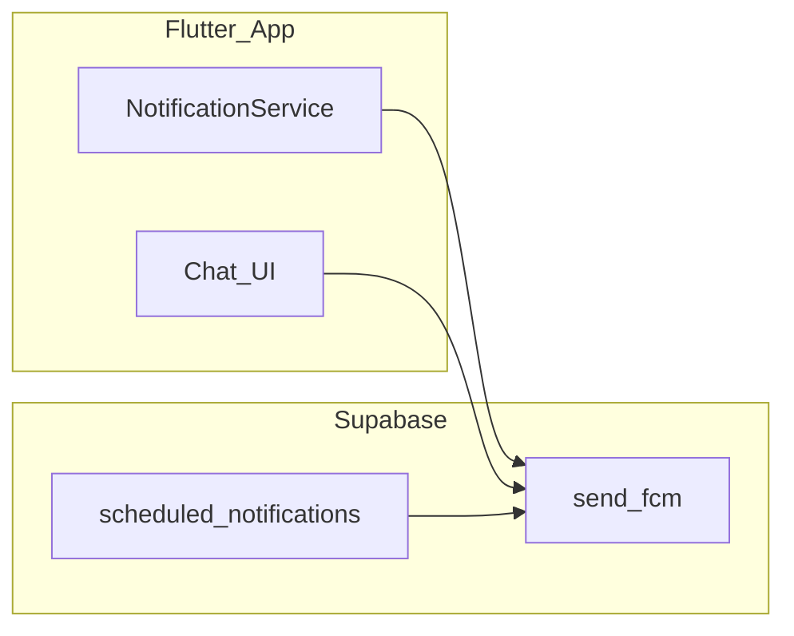

# أنواع الإشعارات (`notificationType`) والجمهور لكل نوع

هذا المستند يصف **من يستلم** كل قيمة `notificationType` المعتمدة في خادم FCM (`supabase/functions/send-fcm/index.ts`، الدالة `soundBaseForNotificationType`)، و**من أين يُرسل** الإشعار في الكود الحالي.

**ملاحظة:** `NotificationService` يغطي فقط الإشعارات **الفورية من التطبيق**. الأنواع التي يملكها **Cron** (`scheduled-notifications`) لا تُعرَّف كدوال Dart — الإرسال من TypeScript فقط. مسار الإرسال للموظف/العميل: `sendFcm` / `sendFcmForClient` / `sendFcmToEmployees` (انظر قسم Cron للأنواع الزمنية).

---

## جدول الأنواع والجمهور

| `notificationType` | الجمهور (من يستلم) | مصدر الإرسال في الكود |
|-------------------|---------------------|------------------------|
| `chat_message` | الموظفون **المشاركون في المحادثة** غير المرسل: في محادثة ثنائية الطرف الآخر؛ في المجموعة **كل المشاركين** عدا المرسل. الإرسال عبر `FirestoreServices.sendFcm` (مسار موظفين). | واجهات المحادثة: `lib/View/Chats/ChatPage.dart`، `MChatPage.dart`؛ و`lib/View/Shared/ResponsiveScaffold.dart`. |
| `employee_task_assigned` | **الموظف المكلَّف** بالمهمة (`assignedTo`). | `NotificationService.notifyEmployeeAssignedToTask` ← `HomeController` عند إنشاء/تعيين مهمة. |
| `employee_task_due_soon` | **الموظف المكلَّف** بالمهمة. | **Cron** فقط: `handleTaskReminders` (نافذتا 24 ساعة و6 ساعات قبل `toDate`). لا يوجد `NotificationService` لهذا النوع. |
| `employee_task_edit_requested` | **الموظف المكلَّف** بالمهمة. | `HomeController` عند طلب تعديل من الإدارة. |
| `employee_task_rejected` | **الموظف المكلَّف** بالمهمة. | `HomeController` عند رفض المهمة. |
| `employee_task_reopened` | **الموظف المكلَّف** بالمهمة. | `HomeController` عند إعادة فتح المهمة. |
| `employee_task_new_attachments` | **الموظف المكلَّف** بالمهمة. | `HomeController` عند إضافة مرفقات. |
| `employee_task_status_changed` | **الموظف المكلَّف** بالمهمة. | `HomeController` عند تغيّر حالة المهمة. |
| `manager_task_received` | **كل** من لديه دور `admin` أو `supervisor`. | `NotificationService.notifyManagersTaskReceivedByEmployee` ← `HomeController`. |
| `manager_task_completed` | **كل** `admin` و`supervisor`. | `NotificationService.notifyManagersTaskCompletedByEmployee` ← `HomeController`. |
| `admin_supervisor_escalated_task` | **المسؤولون بدور `admin` فقط** (لا يشمل `supervisor` في استدعاء الدالة). | `NotificationService.notifyAdminsSupervisorEscalatedTask` ← `HomeController`. |
| `manager_task_edited` | **كل** `admin` و`supervisor`. | `notifyManagersEmployeeEditedTask` عندما يكون التعديل **مرفقات فقط** (`ManagerTaskEditKind.attachment`). |
| `manager_task_comment` | **كل** `admin` و`supervisor`. | نفس الدالة عند تعديل **بتعليق** أو **تعليق + مرفقات**. |
| `manager_content_submitted_by_client` | **كل** `admin` و`supervisor`. | `notifyManagersContentSubmittedByClient` ← `History.dart`، `ContentsTable.dart`، `ContentFormMobilePage.dart`. |
| `manager_task_overdue` | **كل** `admin` و`supervisor`. | **Cron** فقط: `handleTaskReminders` (مهام متأخرة). لا يوجد `NotificationService` لهذا النوع. |
| `manager_new_task_department` | **كل** `admin` و`supervisor`. | `HomeController` عند مهمة جديدة في قسم. |
| `manager_client_notes` | **كل** `admin` و`supervisor`. | `notifyManagersClientNotesOnContent` ← `EditRequestSheet.dart` (مع إشعارات قسم النشر). |
| `manager_client_approved_content` | **كل** `admin` و`supervisor`. | `ClientContentDetails.dart`، `ContentsTable.dart`، `History.dart`. |
| `client_content_pending_approval` | **العميل** صاحب `clientId` الممرَّر. | `History`، `ContentsTable`، `ContentFormMobilePage`. |
| `client_pending_over_24h` | **العميل** صاحب المحتوى (`clientId` على المستند). | **Cron** فقط: `handleContentPendingOver24h`. لا يوجد `NotificationService` لهذا النوع. |
| `client_approval_confirmed` | **العميل** المحدد. | `ClientContentDetails.dart`. |
| `client_edits_done` | **العميل** المحدد. | `ContentFormMobilePage.dart`. |
| `client_content_updated` | **العميل** المحدد. | `History`، `ContentsTable`، `ContentFormMobilePage`. |
| `client_content_scheduled` | **العميل** المحدد. | `ContentFormMobilePage.dart` عند جدولة/تحديث مع تاريخ نشر. |
| `publish_content_added` | **اتحاد**: كل `admin` و`supervisor` **وموظفو قسم النشر** (`getEmployeeIdsByDepartment(departmentPublishing)`). | الدالة `notifyPublishDeptContentAdded` — **لا يوجد استدعاء من `lib/`** حالياً. |
| `publish_client_edit_request` | نفس اتحاد الإدارة + قسم النشر. | `EditRequestSheet.dart` (+ إشعار المديرين بالملاحظات). |
| `publish_client_approved` | نفس الاتحاد. | `ClientContentDetails.dart`. |
| `publish_client_rejected` | نفس الاتحاد. | `RefuseRequestSheet.dart`. |
| `publish_post_one_hour` | **موظف واحد**: المنفّذ `executor` على المحتوى، أو أول موظف من مجموعة النشر إن لم يُحدَّد. | **Cron** فقط: `handlePublishReminders`. لا يوجد `NotificationService` لهذا النوع. |
| `publish_post_not_confirmed_today` | **موظف واحد** (`employeeId`) — حسب من يستدعي الدالة. | الدالة في `NotificationService` — **لا يوجد استدعاء من `lib/`**. |
| `publish_no_posts_tomorrow` | **كل** موظفي النشر + الإدارة المطابقين لفلتر الكرون (`department === cat6` أو `admin`/`supervisor`)، لكل عميل بلا منشور مجدول غداً. | **Cron** فقط: `handlePublishReminders`. لا يوجد `NotificationService` لهذا النوع. |
| `publish_post_published` | **قائمة موظفين** `recipientIds` (يحددها المتصل). | `notifyPublishDeptPostPublished` — **لا يوجد استدعاء من `lib/`**. |
| `publish_link_added` | **قائمة موظفين** `recipientIds`. | الدالة في `NotificationService` — **لا يوجد استدعاء من `lib/`**. |
| `publish_notes_after_publish` | **قائمة موظفين** `recipientIds`. | الدالة في `NotificationService` — **لا يوجد استدعاء من `lib/`**. |
| `publish_scheduled_cancelled` | **قائمة موظفين** `recipientIds`. | الدالة في `NotificationService` — **لا يوجد استدعاء من `lib/`**. |
| `admin_promotion_status_changed` | **كل** من لديه دور `admin` فقط. | `History.dart`، `ContentsTable.dart`. |
| `admin_content_status_changed` | **كل** `admin` فقط. | `ContentsTable.dart`. |
| `promotion_new_published_content` | **موظفو قسم الترويج** (`getEmployeeIdsByDepartment(departmentPromotion)`) فقط (لا يدمج الإدارة في الدالة). | `History.dart`، `ContentsTable.dart`. |
| `broadcast_topic` | **مشتركو موضوع FCM** المختار من الإدارة: `employees` أو `clients` أو `all` (حسب اشتراك الأجهزة في التطبيق). | `FirestoreServices.sendFcmTopic` من `lib/View/Home/Home.dart` مع `notificationType: 'broadcast_topic'`. |

---

## مراجعة منطقية للجمهور (أكثر مقابل أقل)

هذا القسم **توصيات منتجية** بناءً على منطق العمل الشائع؛ التنفيذ يبقى قراراً لكم.

### حيث الجمهور الحالي منطقي (غالباً لا تغيير)

| السياق | التعليل |
|--------|---------|
| إشعارات المهمة للموظف المكلَّف (`employee_task_*` التشغيلية) | المعني المباشر بالتنفيذ؛ توسيعها لكل الشركة يسبب ضوضاء. |
| إشعارات العميل (`client_*`) لعميل واحد | الخصوصية والملكية؛ العميل هو من يتخذ قرار الموافقة. |
| `admin_supervisor_escalated_task` لـ `admin` فقط | تصميم تصعيد مقصود؛ أوسع من ذلك يُلغي معنى «تصعيد للمدير». |
| `chat_message` للمشاركين فقط | متوقع اجتماعياً ولا حاجة لإشعار خارج المحادثة. |
| `broadcast_topic` | الجمهور يختاره المسؤول عن الإرسال؛ وعي بالضوضاء عند `all`. |

### حيث يُفضَّل التفكير في **توسيع** الجمهور

| النوع | الملاحظة |
|--------|-----------|
| **`manager_task_overdue` (Cron)** | اليوم يُرسل لكل `admin` و`supervisor` **فقط**. **الموظف المكلَّف** لا يستلم push من هذا المسار رغم أنه الأكثر تأثراً. منطقياً يستحق **إشعاراً للمكلَّف** (نفس النوع أو نوع منفصل مثل `employee_task_overdue_reminder`) حتى لا يعتمد على تذكير «قريب من الموعد» فقط. |
| **`promotion_new_published_content`** | يصل **قسم الترويج** فقط. إن كان المديرون يحتاجون رؤية كل محتوى مُنشر للترويج (مخاطر/موافقة)، قد يلزم **نسخة أو إشعار إضافي** لـ `admin` (أو مشرفين محددين). |
| **`publish_post_one_hour` (Cron)** | إذا غاب `executor`، يُختار أول موظف من قائمة النشر؛ قد يكون **احتياطياً** إشعار **ثانٍ** لمدير النشر أو لقائمة بديلة إن كان المنفّذ غير مضبوط. |

### حيث يُفضَّل التفكير في **تضييق** الجمهور أو تلخيصه

| النوع | الملاحظة |
|--------|-----------|
| **`manager_*` الواسعة** (`manager_task_received`, `manager_task_completed`, `manager_task_comment`, …) لكل `admin` + `supervisor` | في فرق كبيرة يصبح **الكثير من الإشعارات**. بدائل منطقية: إشعار **مشرفي القسم** أو **من أنشأ المهمة** أو **مسؤول الحساب** فقط، مع بقاء الإدارة العليا على ملخص يومي. |
| **`manager_new_task_department`** | إرساله لكل الإدارة + المشرفين قد يزيد الضوضاء إن لم تكن المهمة ذات صلة بجميع الأقسام. بديل: **قادة القسم** المطابق لنوع المهمة فقط. |
| **`publish_no_posts_tomorrow` (Cron)** | لكل **عميل** بلا منشور غد، يُرسل لـ **كل** موظفي النشر والإدارة المطابقين — أي تكرار **عدد العملاء × عدد الموظفين**. منطقياً قد يُفضَّل: **ملخص واحد يومي** لقسم النشر، أو **مسؤول حساب لكل عميل**، أو تجميع العملاء في إشعار واحد. |
| **`manager_content_submitted_by_client` / الملاحظات والموافقات** | إن وُجد «مسؤول حساب» على مستند العميل، قد يكفي **هو + قسم المحتوى** بدل كل المشرفين. |

### تعارضات تصميمية تستحق قراراً صريحاً

- **`admin_*` مقابل `supervisor`:** بعض الأنواع لـ `admin` فقط (`admin_content_status_changed`, `admin_promotion_status_changed`) وبعضها لـ `admin` + `supervisor`. إن كان المشرف مسؤولاً يومياً عن المحتوى، قد يريد فريقكم **مواءمة** القاعدة (إما توسيع نوعين محددين أو الإبقاء مقصوداً للفصل الإداري).
- **`publish_*` يضم الإدارة + قسم النشر:** مفيد للتنسيق؛ إن أصبح مزعجاً، يمكن **فصل** إشعار «للمشرف» عن «للنشر» بنوعين مختلفين أو قنوات اختيارية.

---

## إشعارات اختبار FCM

- **`lib/Services/push_notification_test_catalog.dart`**: يعرّف عنواناً و`notificationType` لكل نوع للاختبار اليدوي (بما فيها `broadcast_topic`).
- **`lib/View/Home/PushNotificationTestDialog.dart`**: يرسل إشعاراً تجريبياً للمستخدم الحالي عبر `FirestoreServices.sendFcm` مع النوع المختار.

الجمهور هنا: **حساب الموظف الحالي** (جهاز الاختبار)، وليس سيناريو إنتاج.

---

## إشعارات الموضوع (Topic)

- **`FirestoreServices.sendFcmTopic`** من شاشة الإدارة في `Home.dart` يمرّر **`broadcast_topic`** حتى تُطبَّق أصوات/قنوات FCM نفسها عبر `send-fcm`.
- **الجمهور الفعلي:** مشتركو الموضوع — **كل الموظفين** أو **كل العملاء** أو **الاثنين** حسب `HomeController.selectedTypeNotifications`.

---

## Cron (`supabase/functions/scheduled-notifications/index.ts`)

| الدالة | `notificationType` (إن وُجد) | الجمهور |
|--------|------------------------------|---------|
| `handleTaskReminders` — مهام متأخرة | `manager_task_overdue` | كل `admin` و`supervisor`. |
| `handleTaskReminders` — اقتراب التسليم | `employee_task_due_soon` | الموظف المكلَّف `assignedTo`. |
| `handleContentPendingOver24h` | `client_pending_over_24h` | العميل صاحب المحتوى. |
| `handlePublishReminders` — منشور خلال ساعة | `publish_post_one_hour` | المنفّذ أو بديل من مجموعة النشر (انظر الكود). |
| `handlePublishReminders` — لا منشورات غداً | `publish_no_posts_tomorrow` | موظفو النشر + الإدارة المطابقون، لكل عميل بلا منشور غداً. |

---

## مراجع سريعة في المستودع

| ملف | الغرض |
|-----|--------|
| `supabase/functions/send-fcm/index.ts` | خريطة الأصوات لكل `notificationType` |
| `lib/Services/NotificationService.dart` | دوال `notify*` للإشعارات الفورية من التطبيق فقط (ليس أنواع Cron) |
| `lib/Services/FireStoreServices.dart` | `sendFcm`، `sendFcmForClient`، `sendFcmToEmployees`، `sendFcmTopic` |
| `supabase/functions/scheduled-notifications/index.ts` | تذكيرات المهام والمحتوى والنشر |

---

## مخطط تدفق مرجعي

